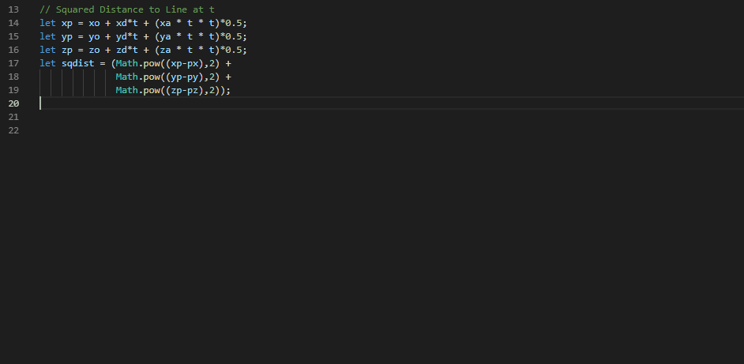

# Symplex

A Symbolic CAS that operates directly on Javascript and Python code.

## Features

> Allows users to highlight blocks of math code and right-click to symbolically integrate, derive, simplify, and more!

## Installation

Symplex requires that Python and `SymPy` are installed.  `SymPy` can be installed with `pip install SymPy`.

## Known Issues

- Javascript parsing is somewhat fragile, this is due for a major refactor to better accomodate for the inconsistences in the nodegraph sourceFile output.
- Interface/instructions for executing SymPy functions are somewhat unintuitive right now.

## Adding new languages

To add a new language:
- Implement the conversion of a block of that language's code to a SymPy string (`convertToSympy()`) inside a new `*LANGUAGE*Support.ts` file.
- Throughout `extension.ts`, add a new case for your [language's identifier](https://code.visualstudio.com/docs/languages/identifiers), calling your `convertToSympy()` function.
- In `python/symplex.py`, add a case for your language's conversion (SymPy supports codegen in many languages already, so check to see if it's already there).
- Test it by building the extension with `F5`!

### Future Work

Add support for 
- Gradients
- Vectors/Matrices
- Algebraic "Functions"
- [Wolfram CAS Backend?](https://blog.wolfram.com/2019/05/16/announcing-the-wolfram-client-library-for-python/)

## Release Notes

### 0.0.7 - First Release

### 0.0.4 - Add Snippets

Group all Symplex functionality underneath the `symplex.Evaluate` command.  Add snippets which document a few of the SymPy features that Symplex exposes. 

### 0.0.3 - Major Refactor

Allow writing of arbitrary SymPy operations, encapsulate adding support for new languages, and add LaTeX output!

### 0.0.2 - Python Support

Since `SymPy` operates natively in Python syntax, it was straight-forward to add basic Python support.

### 0.0.1 - Proof of Concept

Have proven that the typescript AST tree can be transformed into a `SymPy` compatible format, and that Python scripts can be invoked to perform arbitrary work for the editor at low-latencies.  The infrastructure is ready for massive expansion in capability, once the right UI affordances are found and the Javascript/Typescript parsing code is improved.
